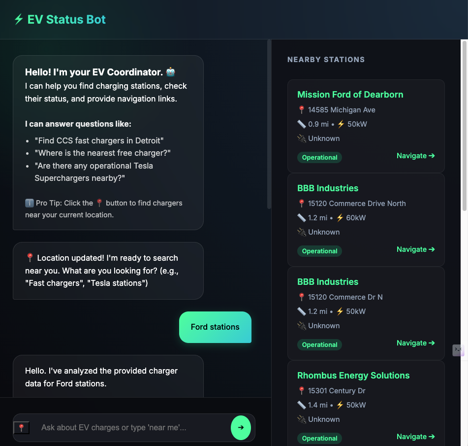

# ⚡ AI-Powered Real-Time EV Infrastructure Assistant

An intelligent, full-stack chatbot designed to modernize the electric vehicle charging experience. By combining real-time infrastructure data with the reasoning capabilities of **Llama 3**, this assistant helps users find reliable charging stations, understand "range anxiety" factors, and navigate with confidence.



## 🚀 What This Project Does

This application breaks the mold of traditional map-based EV finders. Instead of peppering a map with pins, it acts as a **smart coordinator** that understands your specific needs. 

It integrates the **Open Charge Map API** to fetch live station data—including power output, connector types, and operational status. This data is then processed by **Groq’s Llama 3** model, which performs two critical tasks:
1.  **Intent Classification**: Transforming your natural language ("Find me a fast charger near downtown") into precise geospatial queries.
2.  **Context-Aware Reasoning**: Explaining *why* it chose specific stations (e.g., "I recommended this station because it matches your preference for >50kW CCS chargers").

The system also features **Trust Signals** (warning you if data is old) and **Client-Side Personalization** (remembering your name and connector preference across visits).

## 📸 See It In Action (Image Breakdown)

The screenshots in the `assets/` folder demonstrate the core workflow:

1.  **The "Welcome" State**: The bot introduces itself and offers a "Use My Location" button (📍). This isn't just a static link; it uses the browser's Geolocation API to privately determine your coordinates.
2.  **Smart Sidebar**: As you chat, the **Nearby Stations** panel updates in real-time. 
    *   **Trust Badges**: Notice the "Operational" (Green) or "Stale Data" (Orange) badges. This builds trust by being transparent about data freshness.
    *   **Navigate ➔**: A direct link to Google Maps for one-click navigation.
3.  **The Conversation**: The chat interface shows the AI's reasoning. It doesn't just dump a list; it speaks to you like a helpful co-pilot.

## 🛠️ How to Load and Run

Follow these steps to get the engine running on your local machine.

### Prerequisites
*   Python 3.9+
*   A [Groq Cloud](https://console.groq.com) API Key (Free)
*   (Optional) An Open Charge Map API Key

### Installation

1.  **Clone the Repository**
    ```bash
    git clone https://github.com/your-username/ev-status-bot.git
    cd ev-status-bot
    ```

2.  **Set Up Environment Variables**
    Create a `.env` file in the root directory:
    ```bash
    GROQ_API_KEY=your_groq_api_key_here
    OPEN_CHARGE_MAP_API_KEY=your_ocm_api_key_here  # Optional
    ```

3.  **Create Virtual Environment & Install Dependencies**
    ```bash
    python -m venv .venv
    source .venv/bin/activate  # On Windows: .venv\Scripts\activate
    pip install -r requirements.txt
    ```

4.  **Ignition! (Run the App)**
    Start the FastAPI server:
    ```bash
    uvicorn app.main:app --reload
    ```
    
5.  **Access the Dashboard**
    Open your browser and navigate to: [http://localhost:8000](http://localhost:8000)

## 🏗️ Architecture

*   **Backend**: `FastAPI` (High-performance Async Python)
*   **AI Engine**: `Llama-3-70b` via `Groq` (Ultra-low latency inference)
*   **Data Source**: `Open Charge Map API` (Community-sourced global EV registry)
*   **Frontend**: Native `HTML5`, `CSS3` (Glassmorphism), and `Vanilla JS` (No heavy frameworks)

---
*Built with ⚡ for the future of mobility.*
